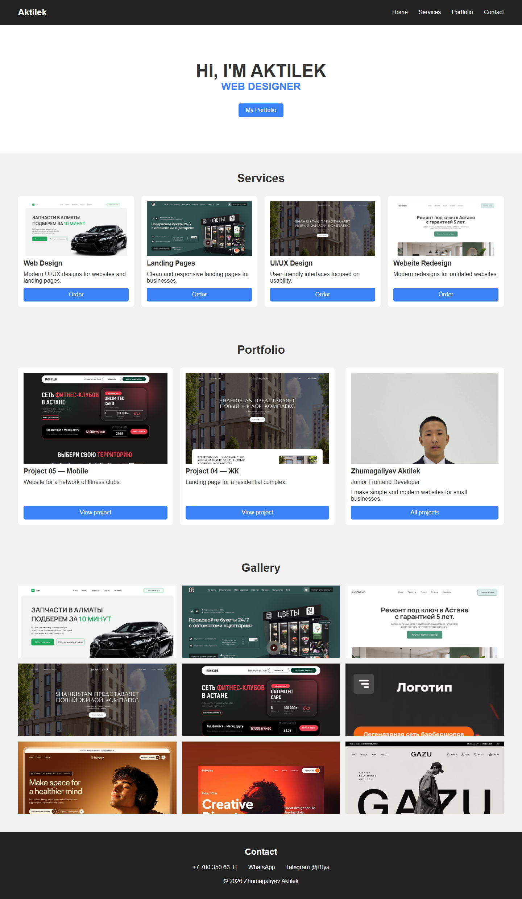
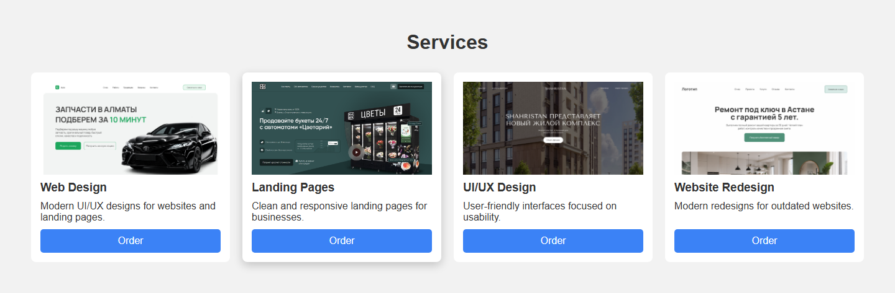
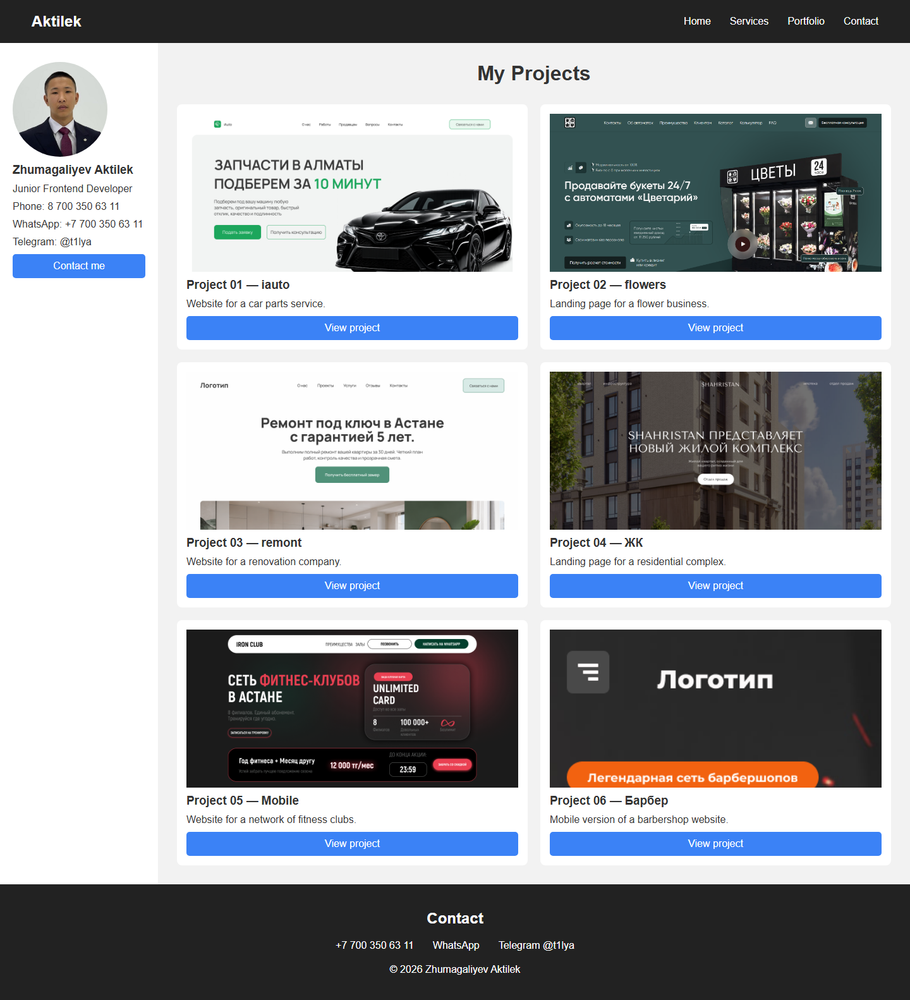
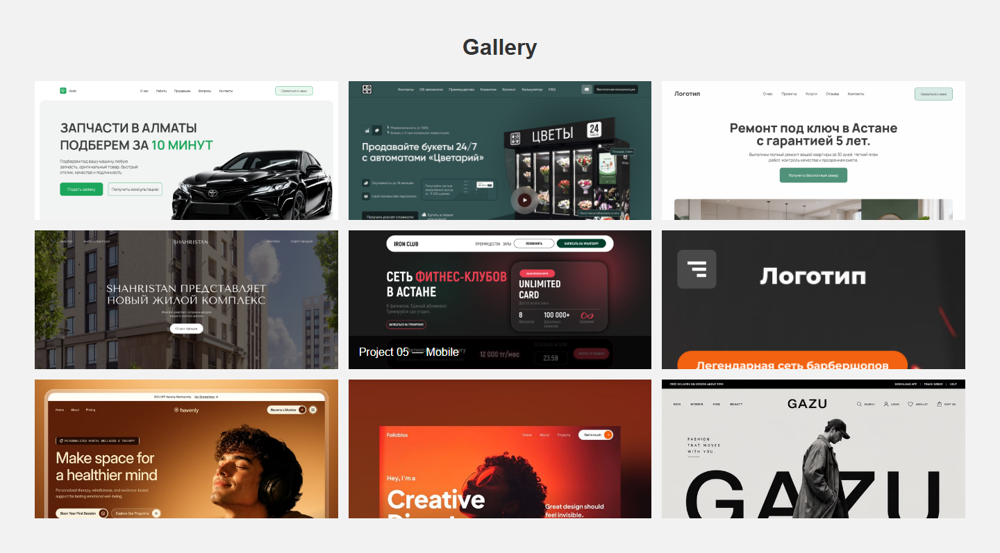
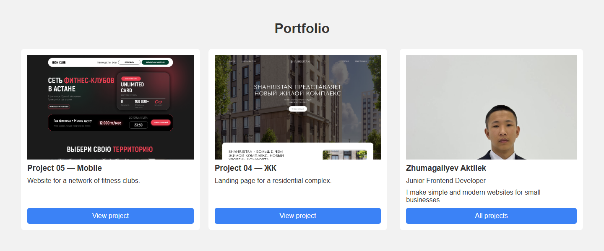

# Assignment #2. Advanced CSS (Flexbox & Grid)

**Name:** Zhumagaliyev Aktilek
**Group:** ____

Topic: a simple website for my web design services.

Files:
- `index.html` — main page (Task 0, 1, 3, 4)
- `portfolio.html` — portfolio page (Task 2)
- `styles.css` — styles
- `images/` — images
- `screenshots/` — screenshots for the report



---

## Part 1. Flexbox

### Task 0. Navigation Bar

The header is a flex container. `justify-content: space-between` puts the logo on the left and the links on the right. `align-items: center` centers them vertically. The links are also in a flex container with `gap: 30px`.

```css
.header {
    display: flex;
    justify-content: space-between;
    align-items: center;
}

.nav {
    display: flex;
    gap: 30px;
}
```


### Task 1. Card Row

There are four cards with an image, title, text and button. The container `.cards` is a flex container with `gap: 20px`. Each card has `flex: 1`, so all cards have the same width and height. The text has `flex: 1`, so all buttons are at the bottom. On hover the card gets a shadow (the second card on the screenshot).

```css
.cards {
    display: flex;
    gap: 20px;
}

.card {
    flex: 1;
    display: flex;
    flex-direction: column;
}

.card:hover {
    box-shadow: 0 5px 15px rgba(0, 0, 0, 0.2);
}
```



---

## Part 2. Grid System

### Task 2. Page Layout with Grid Areas

On `portfolio.html` the container `.page` is a grid with 2 columns and 3 rows. With `grid-template-areas` the header is on the top, the sidebar is on the left, the main content is on the right and the footer is on the bottom.

```css
.page {
    display: grid;
    grid-template-columns: 250px 1fr;
    grid-template-rows: auto 1fr auto;
    grid-template-areas:
        "header header"
        "sidebar main"
        "footer footer";
}
```



### Task 3. Image Gallery

The gallery has 9 images. It is a grid with 3 equal columns and 3 rows, and `gap: 15px`. The caption is hidden (`display: none`) and appears on hover (Project 05 on the screenshot).

```css
.gallery {
    display: grid;
    grid-template-columns: repeat(3, 1fr);
    grid-template-rows: repeat(3, 200px);
    gap: 15px;
}

.gallery-item:hover .caption {
    display: block;
}
```



---

## Part 3. Combining Flexbox & Grid

### Task 4. Portfolio Page

The page has a header with Flexbox navigation, main sections, and a footer on the bottom. The portfolio section is a grid: projects on the left (`2fr`) and info on the right (`1fr`). Inside each project card Flexbox puts the title, description and button in a column.

```css
.portfolio {
    display: grid;
    grid-template-columns: 2fr 1fr;
    gap: 30px;
}

.project {
    display: flex;
    flex-direction: column;
    gap: 10px;
}
```



---

## Summary

First I made the header with Flexbox. Then I made the service cards in one row with Flexbox and added a shadow on hover. After that I made the portfolio page with Grid areas: header, sidebar, main and footer. Then I made a gallery with 9 images using Grid and added a caption on hover. At the end I made the portfolio section where Grid is used for the layout and Flexbox is used inside the project cards. I used only HTML and CSS.
