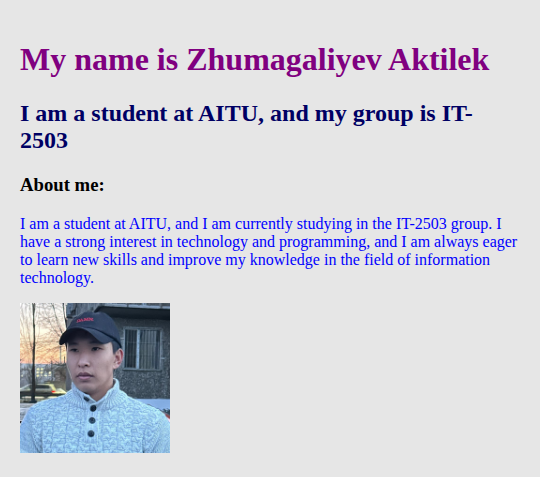
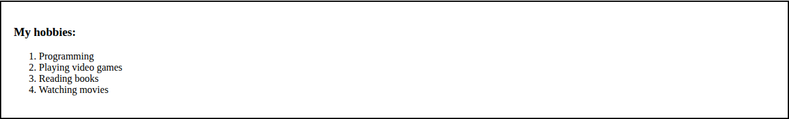
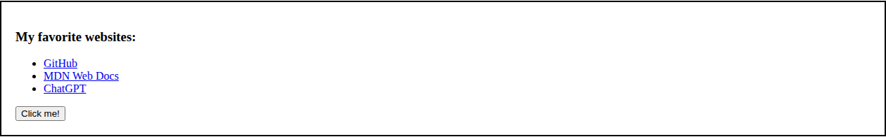
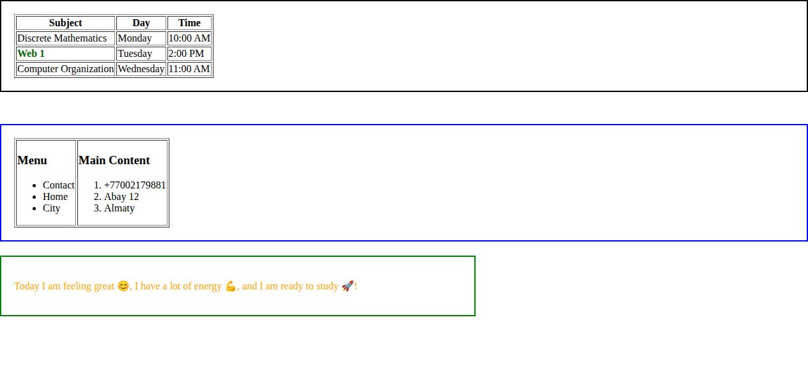
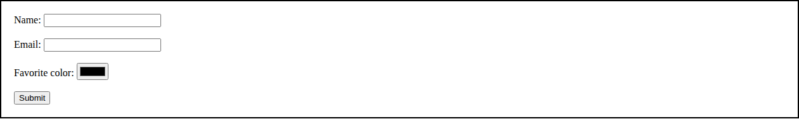
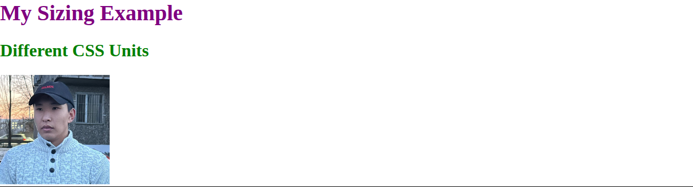
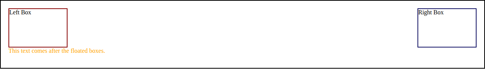
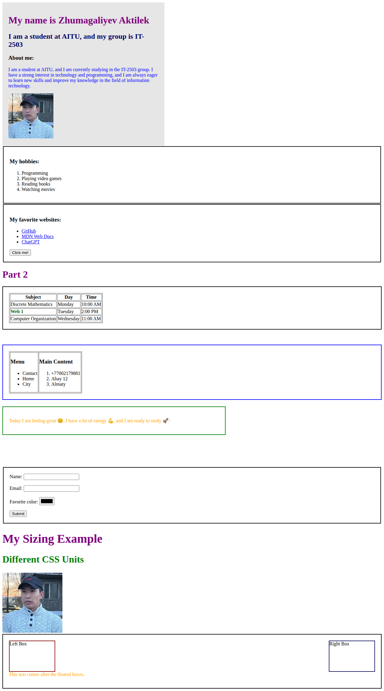

# Assignment #1 — HTML & CSS Basics

**Студент:** Zhumagaliyev Aktilek
**Группа:** IT-2503
**Университет:** AITU (Astana IT University)
**Дисциплина:** Web 1

## Цель работы

Целью данной работы было изучить основы HTML и CSS: создать простую веб-страницу с использованием базовых и промежуточных тегов HTML (текст, списки, изображения, ссылки, таблицы, формы), а также применить стили CSS (inline, internal, external), селекторы (элементы, классы, id), блочную модель, позиционирование, единицы измерения размера и обтекание (float/clear).

## Структура проекта

```
├── Untitled-1.html   # главная страница проекта (разметка HTML)
├── styles.css        # внешний файл стилей (external CSS)
├── images/           # изображения, используемые на странице (фото, favicon)
└── screenshots/       # скриншоты выполненных заданий
```

Страница подключает `styles.css` через `<link rel="stylesheet">`, а также содержит внутренние стили (`<style>` в `<head>`) и inline-стили (`style="..."` на отдельных элементах) — согласно заданию.

## Part 1. Introduction to HTML

**Шаг 0. Базовая структура HTML**
Создан HTML-файл с базовым шаблоном (`<!DOCTYPE html>`, `<html>`, `<head>`, `<title>`, `<body>`), заголовок страницы — "My first webpage".

**Шаг 1. Структурирование текста**
Добавлены заголовки `<h1>`–`<h3>` с именем, группой и разделом "About me", а также короткий абзац `<p>` с описанием себя.

**Шаг 2. Списки**
Добавлен нумерованный список `<ol>` с хобби и маркированный список `<ul>` с любимыми сайтами.

**Шаг 3. Изображения и ссылки**
Добавлена фотография через `` и минимум две кликабельные ссылки `<a>` (GitHub, MDN Web Docs, ChatGPT).

**Шаг 4. Кнопка**
Добавлена кнопка "Click me!" (без функциональности).







## Part 2. Intermediate HTML

**Шаг 5. Таблицы**
Создана таблица с тремя колонками — "Subject", "Day", "Time" — с расписанием занятий.

**Шаг 6. Таблица для разметки (доп. задание)**
Реализован двухколоночный макет через таблицу: левая колонка — меню, правая — основной контент.

**Шаг 7. Эмодзи**
Добавлен абзац с настроением, содержащий минимум 3 эмодзи (😊, 💪, 🚀).



**Шаг 8. Формы**
Создана форма с полями Name (text), Email (email), Favorite Color (color) и кнопкой Submit.



## Part 3. Introduction to CSS

**Шаг 9–10. Inline CSS**
Цвет абзаца "About me" изменён напрямую через `style="color:blue;"`.

**Шаг 11. Internal CSS**
В `<head>` внутри тега `<style>` задано правило для `h1` (фиолетовый цвет).

**Шаг 12. External CSS**
Создан файл `styles.css`, подключённый через `<link rel="stylesheet" href="styles.css">`. В нём вынесены основные правила стилей (цвета `h2`, `p`, оформление блоков и т. д.).

**Шаг 13. Селекторы CSS**
Использованы селектор по элементу (`p {}`, `h2 {}`), по классу (`.highlight {}`) и по id (`#main-title {}`) с разными цветами и шрифтами.

**Шаг 14. Классы и ID**
Создан класс `.highlight` для выделения ячейки таблицы (предмет "Web 1") и id `#main-title` для стилизации подзаголовка.

*(Результат применения этих стилей виден на скриншотах выше — фиолетовый `h1`, синий и оранжевый текст абзацев, зелёный `h2`, выделенная строка таблицы "Web 1" и синий подзаголовок с именем группы.)*

## Part 4. Intermediate CSS

**Шаг 15. Favicon**
Добавлена иконка сайта через `<link rel="icon" type="image/png" href="logo-app.png">`.

**Шаг 16. Div-блоки**
Контент сгруппирован с помощью `<div>` на смысловые секции (`header`, `main-content`), оформленные фоном и отступами.

**Шаг 17. Box Model**
Ко многим блокам добавлены `border`, `margin` и `padding` с разными значениями для проверки эффекта отступов.

**Шаг 18. Позиционирование CSS**
Реализованы три блока с разными типами позиционирования: `static` (таблица расписания), `relative` (таблица меню/контента, смещённая на 10px) и `absolute` (блок с настроением, зафиксированный относительно страницы).

**Шаг 19. Единицы измерения**
Использованы единицы `px`, `%`, `em` в заголовках и изображении блока "My Sizing Example".



**Шаг 20. Float и Clear**
Созданы два блока, один из которых обтекает слева (`float: left`), другой — справа (`float: right`), с последующим `clear: both` для текста ниже.



**Шаг 21. Публикация сайта**
Проект опубликован через GitHub Pages: **[ссылка на опубликованную страницу — добавить после публикации]**

## Общий вид страницы



## Краткое описание процесса работы

Разработка велась в VS Code. Сначала была создана базовая HTML-структура страницы с личной информацией, фотографией, списками, ссылками и кнопкой (Part 1). Затем добавлены более сложные HTML-элементы — таблицы, двухколоночная раскладка через таблицу, эмодзи и форма обратной связи (Part 2). После этого к странице было последовательно применено оформление CSS трёх типов — inline, internal и external, — с разбором разницы между селекторами по элементу, классу и id (Part 3). На финальном этапе страница была доработана с помощью favicon, семантического деления на `div`-блоки, настройки блочной модели (border/margin/padding), трёх видов позиционирования (static/relative/absolute), разных единиц измерения размера (px/%/em) и раскладки с обтеканием float/clear (Part 4). В процессе работы были закреплены основы вёрстки веб-страниц и базового стилизования с помощью CSS.

## Технологии

- HTML5
- CSS3
